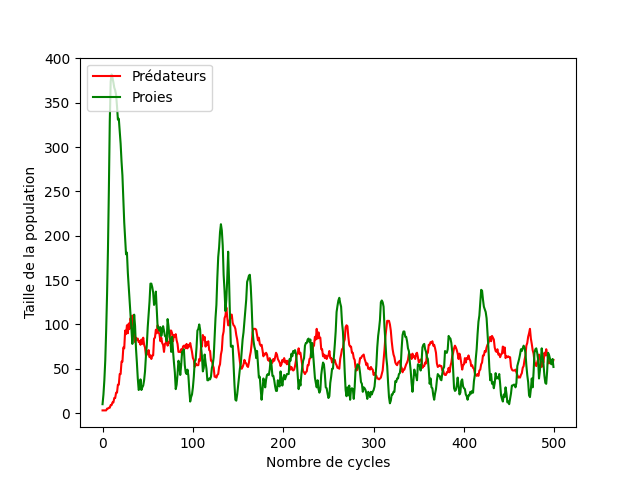

# Projet Hunt : Modèle Proie-Predateur

# Intro

Le projet Hunt à été réalisé dans le cadre de mes études en BUT Informatique (voir hunt.pdf).
Il consiste à implémenter le modèle [proie-predateur](https://fr.m.wikipedia.org/wiki/%C3%89quations_de_pr%C3%A9dation_de_Lotka-Volterra)
en language python.

Les proies (en vert) se reproduisent lorsque qu'une autre est à proximité (case limitrophe). Une nouvelle proie apparait à proximité.
Elle ont une durée de vie qui ne peut pas être augmentée au cours de la simulation.

Les prédateur (en rouge) ont un niveau d'énergie qui peut être augmenté au cours de la simulation en consommant une proie.
Si son niveau d'énergie atteint 0, un prédateur meurt.
Si son niveau d'énergie atteint à certain seuil (EPRE), un nouveau prédateur apparait aléatoirement.

# Structure

Le projet est structuré en 3 fichier python, le fichier main.py, le module tkiteasy et un module contenant les
object Predateur et Proie.
Le module tkiteasy reprend le module Tkinter.

# Exécution

L'exécution du fichier main nécessite les librairies suivantes : PIL, Tkinter et time.
Exécutez le fichier main.

Une fois la simulation terminée, cliquez quelque part dans la fenêtre pour la fermer. 

# Résultat

La simulation respecte bien la relation proie-prédateur:
- lorsque le nombre de proies augmente, celui des prédateurs fait de même.
- lorsque celui-là diminue, le nombre de prédateur diminue également.
- la diminution du nombre de prédateur entraine une prolifération des proies.

Un cycle se forme donc.

